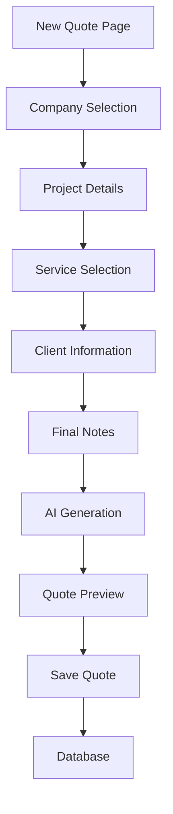
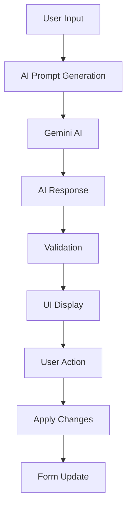
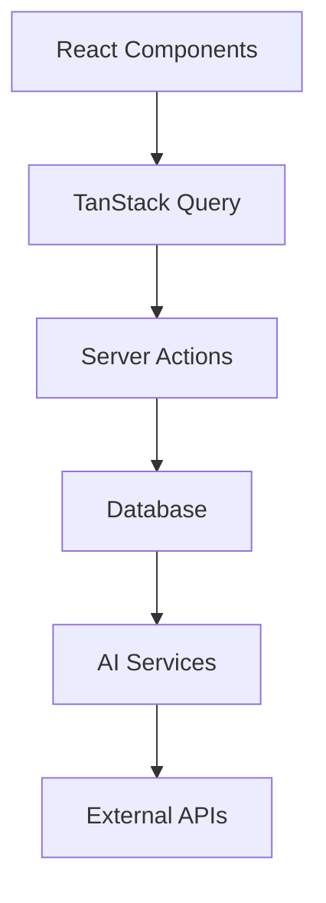

# System Patterns

## Architecture Overview

The application follows a modern Next.js 14 architecture with App Router, featuring:

- **Frontend**: React with TypeScript, Tailwind CSS, shadcn/ui components
- **Backend**: Next.js API routes and server actions
- **Database**: PostgreSQL with Drizzle ORM
- **Storage**: Supabase storage for file uploads
- **AI**: Google Gemini for intelligent features
- **State Management**: TanStack Query for server state, React hooks for local state
- **Authentication**: NextAuth.js with OAuth providers

## Key Design Patterns

### 1. **Quote Creation Pattern**

**Comprehensive Form Management:**

```typescript
// Multi-section form with dynamic service selection
const form = useForm<QuoteFormData>({
  resolver: zodResolver(quoteSchema),
  defaultValues: {
    companyId: '',
    projectTitle: '',
    // ... other fields
  },
})

// Dynamic service management with local state
const [selectedServices, setSelectedServices] = useState<SelectedService[]>([])
```

**Service Selection and Pricing:**

```typescript
// Service toggle with quantity and pricing
const handleServiceToggle = (service: Service) => {
  setSelectedServices((prev) => {
    const existing = prev.find((s) => s.serviceId === service.id)
    if (existing) {
      return prev.filter((s) => s.serviceId !== service.id)
    } else {
      return [
        ...prev,
        {
          serviceId: service.id,
          service,
          quantity: 1,
          unitPrice: parseFloat(service.basePrice || '0'),
          notes: '',
        },
      ]
    }
  })
}
```

**AI Integration with Quote Generation:**

```typescript
// AI-assisted quote generation with enhanced context
const result = await generateAIAssistedQuoteAction({
  companyId: formData.companyId,
  projectData: {
    title: formData.projectTitle,
    description: formData.projectDescription,
    complexity: formData.projectComplexity,
    // ... other project data
  },
  selectedServices: selectedServices.map((s) => ({
    serviceId: s.serviceId,
    serviceName: s.service.name,
    skillLevel: s.service.skillLevel,
    basePrice: s.service.basePrice,
    quantity: s.quantity,
    currentPrice: s.unitPrice,
  })),
})
```

### 2. **Quote Preview Pattern**

**Professional Layout Structure:**

```typescript
// Modular quote sections with consistent styling
<Card>
  <CardHeader>
    <CardTitle>Executive Summary</CardTitle>
  </CardHeader>
  <CardContent>
    <p className="text-muted-foreground">
      {quoteData.quoteDocument.executiveSummary}
    </p>
  </CardContent>
</Card>
```

**Service Breakdown with Calculations:**

```typescript
// Dynamic service rendering with totals
{quoteData.quoteDocument.serviceBreakdown.map((service, index) => (
  <div key={index} className="space-y-3">
    <div className="flex items-center justify-between">
      <h4 className="font-medium">{service.serviceName}</h4>
      <Badge variant="outline">
        ${service.totalPrice.toFixed(2)}
      </Badge>
    </div>
    {/* Service details */}
  </div>
))}
```

### 3. **AI Integration Pattern**

**Company Summary Generation:**

```typescript
// Background processing with status tracking
const [company] = await db.insert(companies).values(data).returning()
// Trigger AI generation in background
generateCompanySummary(company.id)
```

**AI Quote Pricing with Confidence Levels:**

```typescript
// Structured AI prompts with validation
const aiResponse = await generateAIAssistedQuote({
  companyData: {
    /* company context with AI summary */
  },
  projectData: {
    /* project requirements */
  },
})
// Validate and apply confidence thresholds
const validatedResponse = validateConfidenceLevels(aiResponse)
```

**Enhanced Context Integration:**

- Company AI summaries included in pricing prompts
- Market analysis based on location and business context
- Confidence levels (high/medium/low) with visual indicators
- Price range validation with min/max thresholds

**AI Recommendations with Interactive Features:**

```typescript
// AI response structure with market analysis
interface AIQuoteResponse {
  marketAnalysis: {
    locationFactor: string
    marketConditions: string
    competitivePosition: string
  }
  serviceRecommendations: Array<{
    serviceName: string
    currentPrice: number
    recommendedPrice: number
    confidenceLevel: 'high' | 'medium' | 'low'
    reasoning: string
    priceRange: { min: number; max: number }
  }>
  negotiationTips: string[]
}
```

### 4. **Subscription Management Pattern**

**Real-time Usage Tracking:**

```typescript
// Database functions for monthly quote counting
const currentQuotes = await db.execute(sql`
  SELECT COUNT(*) FROM quotes 
  WHERE user_id = ${userId} 
  AND created_at >= date_trunc('month', CURRENT_DATE)
`)
```

**Limit Enforcement:**

```typescript
// Server-side validation before operations
const canCreate = await canUserCreateQuote(userId, subscriptionTier)
if (!canCreate) {
  return { success: false, error: 'Quote limit reached' }
}
```

**UI Integration:**

- Header-based subscription status display
- TanStack Query hooks for efficient caching
- Real-time updates with background refetching

### 5. **Data Fetching Pattern (TanStack Query)**

**Optimized Caching Strategy:**

```typescript
// 5-minute stale time, 10-minute cache time
const { data: companies } = useCompaniesQuery({
  staleTime: 5 * 60 * 1000, // 5 minutes
  gcTime: 10 * 60 * 1000, // 10 minutes
})
```

**Skeleton Loading States:**

```typescript
// Meaningful loading states over spinners
if (isLoading) return <SidebarSkeleton />
if (error) return <ErrorState />
```

**Background Refetching:**

- Fresh data fetched in background when stale
- No loading flashes or user interruption
- Automatic retries for failed requests

### 6. **Form Management Pattern**

**Multi-step Forms with Persistence:**

```typescript
// localStorage persistence with hydration
const [currentStep, setCurrentStep] = useState(() => {
  if (typeof window !== 'undefined') {
    return parseInt(localStorage.getItem('currentStep') || '0')
  }
  return 0
})
```

**Validation and Error Handling:**

```typescript
// Zod schema validation with server actions
const form = useForm<FormData>({
  resolver: zodResolver(schema),
  defaultValues: getStoredValues(),
})
```

### 7. **File Upload Pattern**

**Supabase Storage Integration:**

```typescript
// Controlled upload with preview
const uploadLogo = async (file: File) => {
  const { data, error } = await supabase.storage
    .from('company-logos')
    .upload(`${userId}/${filename}`, file)
}
```

**Base64 Preview:**

```typescript
// Immediate preview while uploading
const preview = await fileToBase64(file)
setLogoPreview(preview)
```

### 8. **Server Actions Pattern**

**Modular Organization:**

```
server-actions/
├── auth.ts          # Authentication actions
├── company.ts       # Company management
├── quote.ts         # Quote operations
├── subscription.ts  # Subscription tracking
└── index.ts         # Clean exports
```

**Type-safe Implementation:**

```typescript
// Proper TypeScript interfaces throughout
interface CreateQuoteData {
  userId: string
  companyId: string
  // ... other fields
}

export async function createQuoteAction(data: CreateQuoteData) {
  // Implementation with proper error handling
}
```

**Quote Creation with AI Integration:**

```typescript
// Complete quote creation workflow
export async function createQuoteAction(data: CreateQuoteData) {
  // Check subscription limits
  const canCreate = await canUserCreateQuote(data.userId, 'free')

  // Generate AI quote document
  const finalQuoteResult = await generateFinalQuoteAction({
    companyId: data.companyId,
    projectData: data.projectData,
    finalData: data.finalData,
  })

  // Save to database with all data
  const [quote] = await db
    .insert(quotes)
    .values({
      userId: data.userId,
      companyId: data.companyId,
      // ... other fields
    })
    .returning()

  // Insert quote services
  await db.insert(quoteServices).values(quoteServiceData)
}
```

### 9. **Component Architecture Pattern**

**Atomic Design with Feature Organization:**

```
components/
├── ui/              # Reusable UI components
├── form-ui/         # Form-specific components
├── navbar/          # Navigation components
└── providers/       # Context providers
```

**Skeleton Loading Pattern:**

```typescript
// Content-specific skeletons
export function SidebarSkeleton() {
  return (
    <div className="space-y-4">
      <div className="h-8 bg-muted animate-pulse rounded" />
      {/* More skeleton elements */}
    </div>
  )
}
```

**Quote Preview Component Pattern:**

```typescript
// Modular quote sections with consistent styling
export function QuotePreview({ quoteData, onClose }: QuotePreviewProps) {
  const totalAmount = quoteData.quoteDocument.serviceBreakdown.reduce(
    (sum, service) => sum + service.totalPrice,
    0,
  )

  return (
    <div className="space-y-6">
      {/* Executive Summary */}
      <Card>
        <CardHeader>
          <CardTitle>Executive Summary</CardTitle>
        </CardHeader>
        <CardContent>
          <p className="text-muted-foreground">
            {quoteData.quoteDocument.executiveSummary}
          </p>
        </CardContent>
      </Card>

      {/* Service Breakdown */}
      <Card>
        {/* Service details with pricing */}
      </Card>

      {/* Terms and other sections */}
    </div>
  )
}
```

### 10. **Database Schema Pattern**

**Quote Management Schema:**

```sql
-- Quotes table with comprehensive fields
CREATE TABLE quotes (
  id UUID PRIMARY KEY DEFAULT gen_random_uuid(),
  user_id UUID NOT NULL REFERENCES users(id) ON DELETE CASCADE,
  company_id UUID NOT NULL REFERENCES companies(id) ON DELETE CASCADE,
  project_title VARCHAR(255) NOT NULL,
  project_description TEXT,
  amount DECIMAL(10,2),
  currency VARCHAR(3) DEFAULT 'USD' NOT NULL,
  status quote_status DEFAULT 'draft' NOT NULL,
  client_email VARCHAR(255),
  client_name VARCHAR(255),
  sent_at TIMESTAMP,
  created_at TIMESTAMP DEFAULT NOW() NOT NULL,
  updated_at TIMESTAMP DEFAULT NOW() NOT NULL
);

-- Quote services junction table
CREATE TABLE quote_services (
  id UUID PRIMARY KEY DEFAULT gen_random_uuid(),
  quote_id UUID NOT NULL REFERENCES quotes(id) ON DELETE CASCADE,
  service_id UUID NOT NULL REFERENCES services(id) ON DELETE CASCADE,
  quantity DECIMAL(5,2) DEFAULT '1' NOT NULL,
  unit_price DECIMAL(10,2),
  total_price DECIMAL(10,2),
  notes TEXT,
  created_at TIMESTAMP DEFAULT NOW() NOT NULL
);
```

### 11. **Error Handling Pattern**

**Graceful Error Handling:**

```typescript
// Server action error handling
export async function createQuoteAction(data: CreateQuoteData) {
  try {
    // Implementation
    return { success: true, quote }
  } catch (error) {
    console.error('Error creating quote:', error)
    return {
      success: false,
      error: 'Failed to create quote',
    }
  }
}
```

**User-Friendly Error Messages:**

```typescript
// Form validation with clear error messages
const quoteSchema = z.object({
  companyId: z.string().min(1, 'Please select a company'),
  projectTitle: z.string().min(1, 'Project title is required'),
  clientLocation: z.string().min(1, 'Client location is required'),
  // ... other validations
})
```

### 12. **Performance Optimization Pattern**

**Intelligent Caching:**

```typescript
// TanStack Query with optimized settings
const { data: companies } = useCompaniesQuery({
  staleTime: 5 * 60 * 1000, // 5 minutes
  gcTime: 10 * 60 * 1000, // 10 minutes
  refetchOnWindowFocus: false,
  retry: 1,
})
```

**Background Processing:**

```typescript
// AI generation in background without blocking UI
const generateCompanySummary = async (companyId: string) => {
  // Update status to generating
  await db
    .update(companies)
    .set({ aiSummaryStatus: 'generating' })
    .where(eq(companies.id, companyId))

  try {
    // Generate AI summary
    const summary = await generateAISummary(companyData)

    // Update with result
    await db
      .update(companies)
      .set({
        aiSummary: summary,
        aiSummaryStatus: 'completed',
      })
      .where(eq(companies.id, companyId))
  } catch (error) {
    // Handle error
    await db
      .update(companies)
      .set({ aiSummaryStatus: 'failed' })
      .where(eq(companies.id, companyId))
  }
}
```

## Component Relationships

### Quote Creation Flow



### AI Integration Flow



### Data Flow Architecture



## Best Practices

1. **Type Safety**: Use TypeScript interfaces for all data structures
2. **Error Handling**: Implement graceful error handling at all levels
3. **Performance**: Use TanStack Query for intelligent caching
4. **UX**: Provide meaningful loading states and feedback
5. **Security**: Validate all inputs and implement proper authentication
6. **Scalability**: Use modular architecture for easy expansion
7. **Testing**: Write comprehensive tests for all critical paths
8. **Documentation**: Maintain clear documentation for all patterns

This architecture provides a solid foundation for the PricingGPT platform with AI-powered features, robust subscription management, and excellent user experience.
