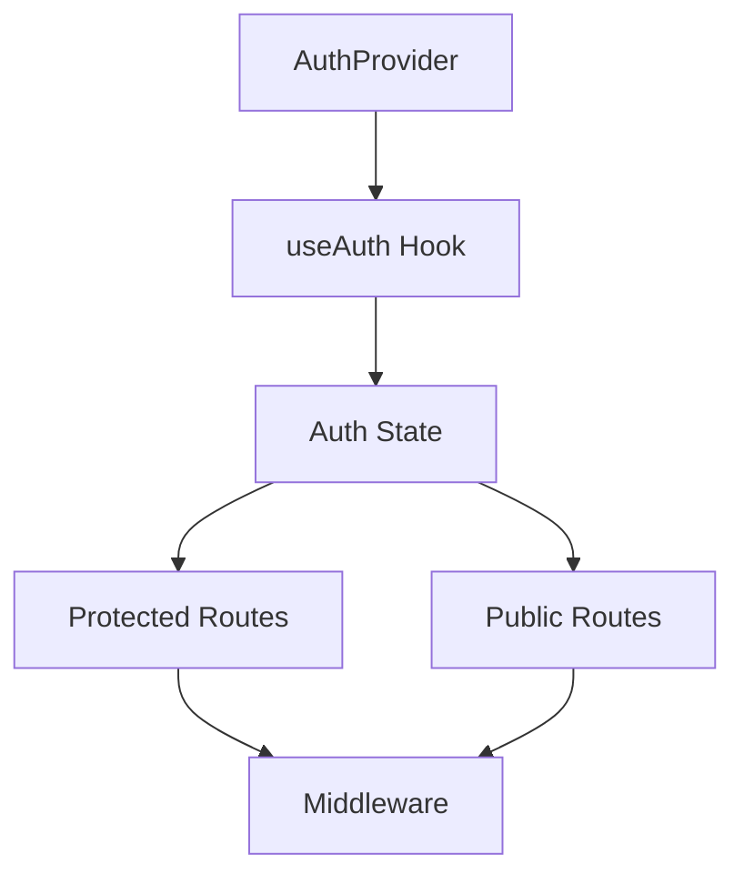
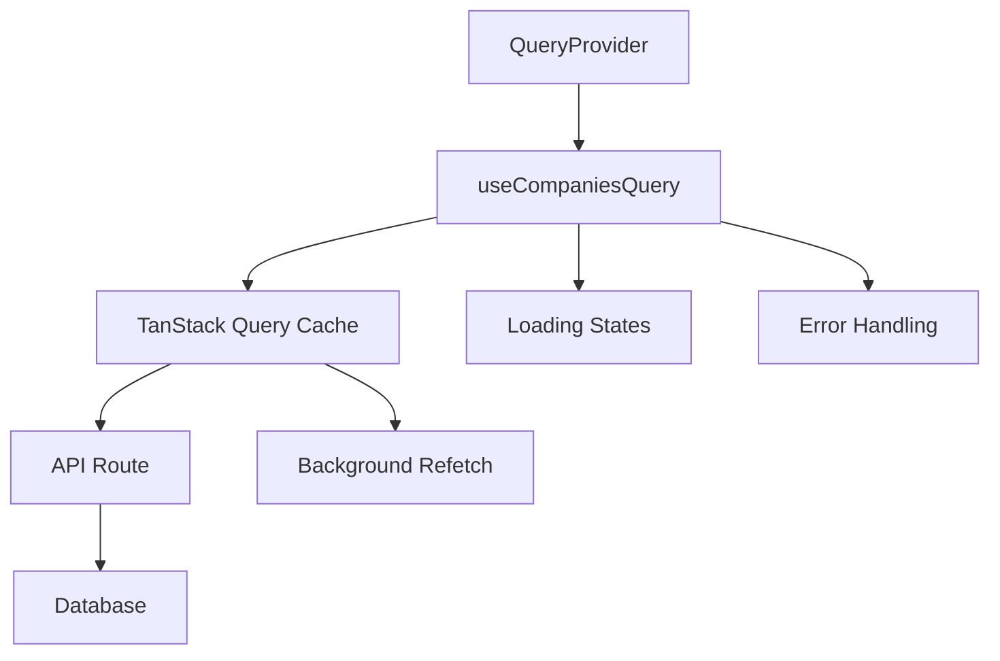
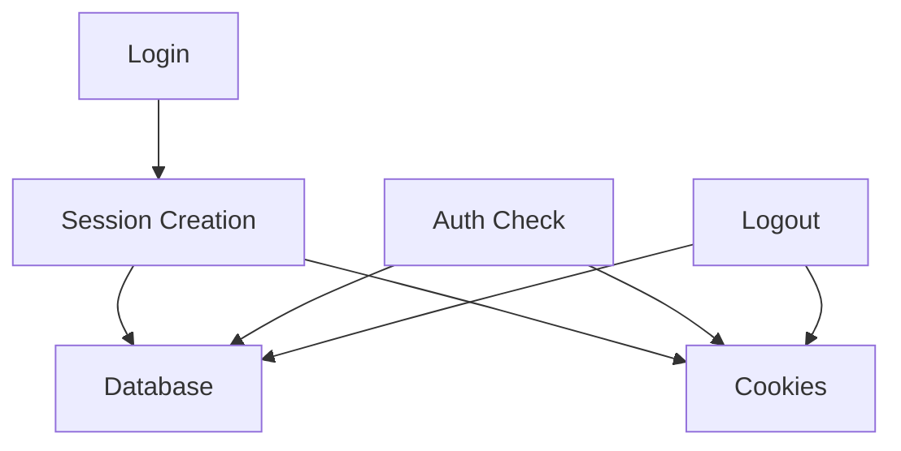

# System Patterns

## Architecture Overview

### Authentication System

- Database-backed sessions with secure cookie handling
- Client-side state management using Zustand
- Server-side session validation and management
- Middleware-based route protection
- Provider pattern for auth state management

### UI Components

- Responsive navbar with scroll-based animations
- Theme-aware components with dark mode support
- Form components with validation and error handling
- Toast notifications for user feedback
- **NEW: Skeleton loading states for better UX**

### State Management

- Zustand for global state (auth, theme)
- **NEW: TanStack Query for server state (implemented)**
- Local storage for persistence
- Context providers for theme and auth

### Security Patterns

- Password hashing with bcrypt and pepper
- Secure session cookies (httpOnly, sameSite)
- CSRF protection
- Rate limiting preparation
- Input validation with Zod

### API Patterns

- RESTful API routes
- Middleware for route protection
- Error handling and validation
- Session management
- Database operations with Drizzle ORM

### **NEW: Data Fetching Patterns**

- TanStack Query for intelligent caching
- 5-minute stale time, 10-minute cache time
- Background refetching for fresh data
- Automatic retries for failed requests
- Query keys based on user ID for proper invalidation
- Dev tools for debugging and monitoring

### **NEW: Loading State Patterns**

- Skeleton loading over spinners for better UX
- Component-specific skeletons (SidebarSkeleton, DashboardSkeleton, etc.)
- Loading states that match content structure
- No flashing content or race conditions
- Progressive loading with meaningful placeholders

## Component Relationships

### Auth Flow



### **NEW: Data Fetching Flow**



### Session Management



## Design Patterns

### Provider Pattern

- AuthProvider for authentication state
- ThemeProvider for theme management
- ToastProvider for notifications
- **NEW: QueryProvider for data fetching**

### Hook Pattern

- useAuth for authentication
- useTheme for theme management
- **NEW: useCompaniesQuery for optimized data fetching**
- Custom hooks for reusable logic

### Middleware Pattern

- Route protection
- Session validation
- API route protection

### **NEW: Skeleton Pattern**

- Component-specific skeleton loading
- Structure matching the actual content
- Smooth transitions without flashing
- Progressive content reveal

## Technical Decisions

### Database

- PostgreSQL with Drizzle ORM
- Session storage in database
- User and account management

### Authentication

- Database-backed sessions
- Secure cookie handling
- Regular auth checks

### UI/UX

- Responsive design
- Theme support
- Animation system
- **NEW: Skeleton loading states**
- **NEW: TanStack Query for smooth data fetching**

### **NEW: Data Fetching**

- TanStack Query for intelligent caching
- Background refetching for fresh data
- Proper error handling and retries
- Dev tools for debugging

## Implementation Notes

- All components are type-safe
- Error handling is comprehensive
- Security is prioritized
- Performance is monitored
- Code is modular and maintainable
- **NEW: Loading states are meaningful and non-jarring**
- **NEW: Data fetching is optimized and cached**

## **NEW: TanStack Query Patterns**

### Query Configuration

```typescript
const {
  data: companies = [],
  isLoading,
  error,
  refetch,
} = useQuery({
  queryKey: ['companies', user?.id],
  queryFn: async () => {
    if (!user) return []
    const result = await getUserCompaniesAction(user.id)
    if (result.success && result.companies) {
      return result.companies
    }
    throw new Error(result.error || 'Failed to fetch companies')
  },
  enabled: !!user,
  staleTime: 5 * 60 * 1000, // 5 minutes
  gcTime: 10 * 60 * 1000, // 10 minutes
})
```

### Query Provider Setup

```typescript
const [queryClient] = useState(
  () =>
    new QueryClient({
      defaultOptions: {
        queries: {
          staleTime: 5 * 60 * 1000, // 5 minutes
          gcTime: 10 * 60 * 1000, // 10 minutes
          retry: 1,
          refetchOnWindowFocus: false,
        },
      },
    }),
)
```

### Skeleton Loading Pattern

```typescript
// Component-specific skeleton
export function DashboardSkeleton() {
  return (
    <div className="space-y-6">
      <Skeleton className="h-8 w-48" />
      <div className="rounded-lg border p-4">
        <Skeleton className="mb-2 h-6 w-32" />
        <div className="space-y-3">
          <Skeleton className="h-16 w-full" />
          <Skeleton className="h-16 w-full" />
        </div>
      </div>
    </div>
  )
}

// Usage in component
if (isLoading) {
  return <DashboardSkeleton />
}
```

## Authentication Patterns

### OAuth Implementation

1. Provider-Specific Routes:

   ```typescript
   /api/auth/[provider]/route.ts         // Initial OAuth redirect
   /api/auth/callback/[provider]/route.ts // OAuth callback handling
   ```

2. State Parameter Flow:

   - Generate UUID for state
   - Store in secure cookie
   - Verify in callback
   - Prevent CSRF attacks

3. Token Management:

   - Google:
     - Access token (short-lived)
     - Refresh token (long-lived)
     - Token expiration tracking
   - GitHub:
     - Non-expiring access token
     - No refresh token needed

4. Provider Conflict Prevention:

   ```typescript
   // Check for existing provider account
   const [existingAccount] = await db
     .select()
     .from(accounts)
     .where(and(eq(accounts.userId, user.id), eq(accounts.provider, provider)))

   // Check for other provider accounts
   const [otherProviderAccount] = await db
     .select()
     .from(accounts)
     .where(eq(accounts.userId, user.id))
   ```

5. Error Handling Pattern:
   ```typescript
   // Redirect with error message
   return NextResponse.redirect(
     new URL(
       `/login?error=${encodeURIComponent(errorMessage)}`,
       req.url,
     ),
   )
   ```

### Session Management

1. Session Creation:

   ```typescript
   const sessionToken = crypto.randomUUID()
   const expiresAt = new Date(
     now.getTime() + SESSION_EXPIRES_DAYS * 24 * 60 * 60 * 1000,
   )
   ```

2. Cookie Security:
   ```typescript
   response.cookies.set(SESSION_COOKIE_NAME, sessionToken, {
     httpOnly: true,
     secure: env.NODE_ENV === 'production',
     sameSite: 'lax',
     path: '/',
     expires: expiresAt,
   })
   ```

## Database Patterns

### Account Linking

1. User-Provider Relationship:

   ```typescript
   // One user can have multiple provider accounts
   // But one email can only be associated with one provider
   accounts {
     userId: string
     provider: string
     providerAccountId: string
     accessToken: string
     refreshToken: string | null
     expiresAt: Date
   }
   ```

2. Provider-Specific Data:
   - Google: Stores refresh token for future API access
   - GitHub: Uses non-expiring access token

## Error Handling Patterns

### OAuth Error Flow

1. Validation Errors:

   - State mismatch
   - Missing code
   - Provider conflicts

2. API Errors:

   - Token exchange failures
   - User info fetch failures
   - Database operation failures

3. User Feedback:
   - Redirect-based error display
   - Toast notifications
   - Clear error messages

## Security Patterns

### OAuth Security

1. State Parameter:

   - CSRF protection
   - Request validation
   - Secure cookie storage

2. Token Security:

   - Secure storage
   - Proper expiration
   - Refresh token handling

3. Provider Conflict Prevention:
   - Email uniqueness
   - Provider exclusivity
   - Clear user feedback
