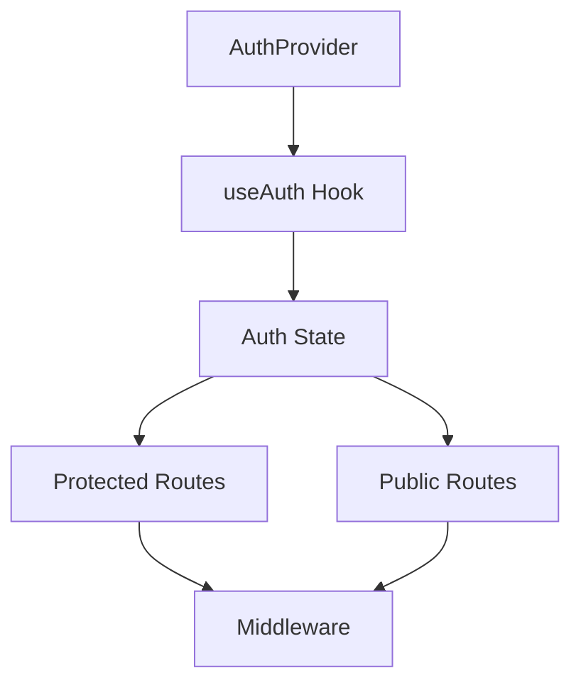
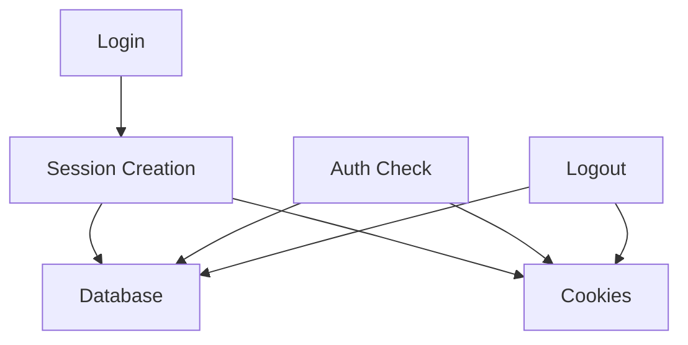

# System Patterns

## Architecture Overview

### Authentication System

- Database-backed sessions with secure cookie handling
- Client-side state management using Zustand
- Server-side session validation and management
- Middleware-based route protection
- Provider pattern for auth state management

### UI Components

- Responsive navbar with scroll-based animations
- Theme-aware components with dark mode support
- Form components with validation and error handling
- Toast notifications for user feedback
- Loading states and transitions

### State Management

- Zustand for global state (auth, theme)
- React Query for server state (planned)
- Local storage for persistence
- Context providers for theme and auth

### Security Patterns

- Password hashing with bcrypt and pepper
- Secure session cookies (httpOnly, sameSite)
- CSRF protection
- Rate limiting preparation
- Input validation with Zod

### API Patterns

- RESTful API routes
- Middleware for route protection
- Error handling and validation
- Session management
- Database operations with Drizzle ORM

## Component Relationships

### Auth Flow

### Session Management

## Design Patterns

### Provider Pattern

- AuthProvider for authentication state
- ThemeProvider for theme management
- ToastProvider for notifications

### Hook Pattern

- useAuth for authentication
- useTheme for theme management
- Custom hooks for reusable logic

### Middleware Pattern

- Route protection
- Session validation
- API route protection

## Technical Decisions

### Database

- PostgreSQL with Drizzle ORM
- Session storage in database
- User and account management

### Authentication

- Database-backed sessions
- Secure cookie handling
- Regular auth checks

### UI/UX

- Responsive design
- Theme support
- Animation system
- Loading states

## Implementation Notes

- All components are type-safe
- Error handling is comprehensive
- Security is prioritized
- Performance is monitored
- Code is modular and maintainable
