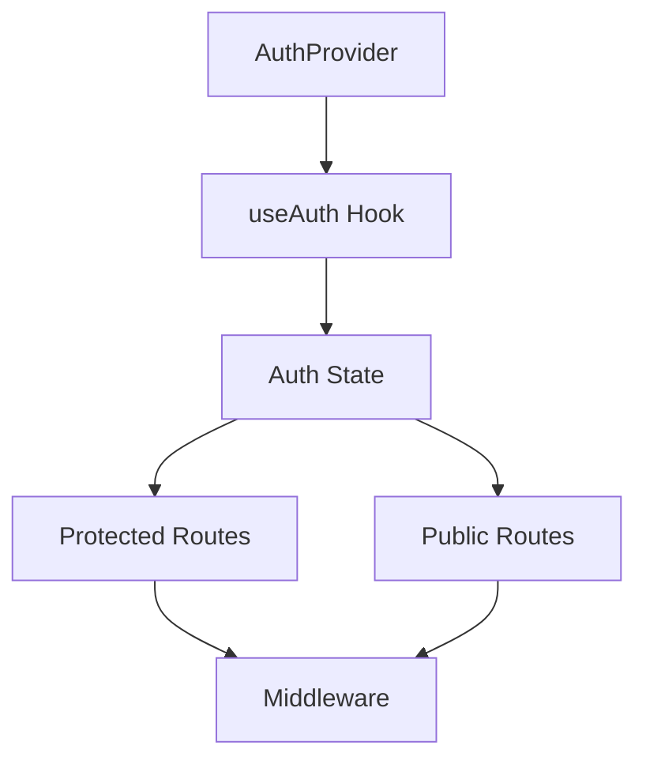
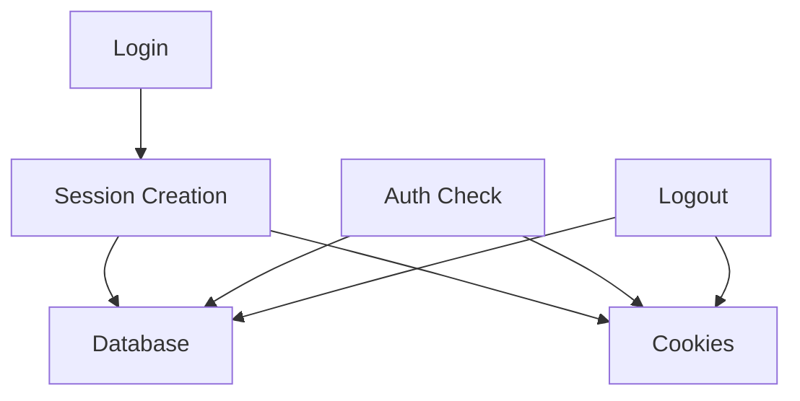

# System Patterns

## Architecture Overview

### Authentication System

- Database-backed sessions with secure cookie handling
- Client-side state management using Zustand
- Server-side session validation and management
- Middleware-based route protection
- Provider pattern for auth state management

### UI Components

- Responsive navbar with scroll-based animations
- Theme-aware components with dark mode support
- Form components with validation and error handling
- Toast notifications for user feedback
- Loading states and transitions

### State Management

- Zustand for global state (auth, theme)
- React Query for server state (planned)
- Local storage for persistence
- Context providers for theme and auth

### Security Patterns

- Password hashing with bcrypt and pepper
- Secure session cookies (httpOnly, sameSite)
- CSRF protection
- Rate limiting preparation
- Input validation with Zod

### API Patterns

- RESTful API routes
- Middleware for route protection
- Error handling and validation
- Session management
- Database operations with Drizzle ORM

## Component Relationships

### Auth Flow



### Session Management



## Design Patterns

### Provider Pattern

- AuthProvider for authentication state
- ThemeProvider for theme management
- ToastProvider for notifications

### Hook Pattern

- useAuth for authentication
- useTheme for theme management
- Custom hooks for reusable logic

### Middleware Pattern

- Route protection
- Session validation
- API route protection

## Technical Decisions

### Database

- PostgreSQL with Drizzle ORM
- Session storage in database
- User and account management

### Authentication

- Database-backed sessions
- Secure cookie handling
- Regular auth checks

### UI/UX

- Responsive design
- Theme support
- Animation system
- Loading states

## Implementation Notes

- All components are type-safe
- Error handling is comprehensive
- Security is prioritized
- Performance is monitored
- Code is modular and maintainable

## Authentication Patterns

### OAuth Implementation

1. Provider-Specific Routes:

   ```typescript
   /api/auth/[provider]/route.ts         // Initial OAuth redirect
   /api/auth/callback/[provider]/route.ts // OAuth callback handling
   ```

2. State Parameter Flow:

   - Generate UUID for state
   - Store in secure cookie
   - Verify in callback
   - Prevent CSRF attacks

3. Token Management:

   - Google:
     - Access token (short-lived)
     - Refresh token (long-lived)
     - Token expiration tracking
   - GitHub:
     - Non-expiring access token
     - No refresh token needed

4. Provider Conflict Prevention:

   ```typescript
   // Check for existing provider account
   const [existingAccount] = await db
     .select()
     .from(accounts)
     .where(and(eq(accounts.userId, user.id), eq(accounts.provider, provider)))

   // Check for other provider accounts
   const [otherProviderAccount] = await db
     .select()
     .from(accounts)
     .where(eq(accounts.userId, user.id))
   ```

5. Error Handling Pattern:
   ```typescript
   // Redirect with error message
   return NextResponse.redirect(
     new URL(
       `/login?error=${encodeURIComponent(errorMessage)}`,
       req.url,
     ),
   )
   ```

### Session Management

1. Session Creation:

   ```typescript
   const sessionToken = crypto.randomUUID()
   const expiresAt = new Date(
     now.getTime() + SESSION_EXPIRES_DAYS * 24 * 60 * 60 * 1000,
   )
   ```

2. Cookie Security:
   ```typescript
   response.cookies.set(SESSION_COOKIE_NAME, sessionToken, {
     httpOnly: true,
     secure: env.NODE_ENV === 'production',
     sameSite: 'lax',
     path: '/',
     expires: expiresAt,
   })
   ```

## Database Patterns

### Account Linking

1. User-Provider Relationship:

   ```typescript
   // One user can have multiple provider accounts
   // But one email can only be associated with one provider
   accounts {
     userId: string
     provider: string
     providerAccountId: string
     accessToken: string
     refreshToken: string | null
     expiresAt: Date
   }
   ```

2. Provider-Specific Data:
   - Google: Stores refresh token for future API access
   - GitHub: Uses non-expiring access token

## Error Handling Patterns

### OAuth Error Flow

1. Validation Errors:

   - State mismatch
   - Missing code
   - Provider conflicts

2. API Errors:

   - Token exchange failures
   - User info fetch failures
   - Database operation failures

3. User Feedback:
   - Redirect-based error display
   - Toast notifications
   - Clear error messages

## Security Patterns

### OAuth Security

1. State Parameter:

   - CSRF protection
   - Request validation
   - Secure cookie storage

2. Token Security:

   - Secure storage
   - Proper expiration
   - Refresh token handling

3. Provider Conflict Prevention:
   - Email uniqueness
   - Provider exclusivity
   - Clear user feedback
