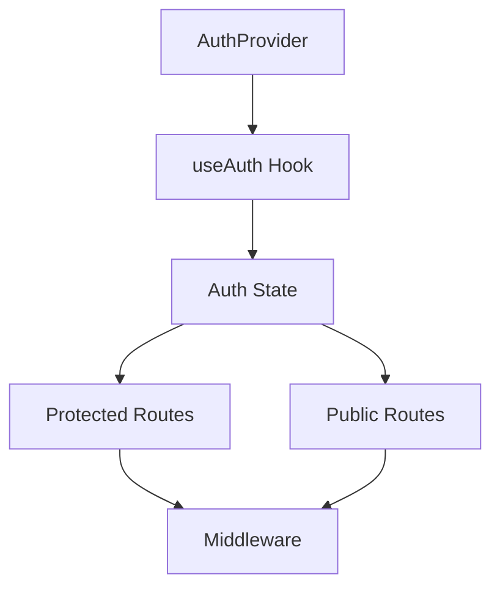
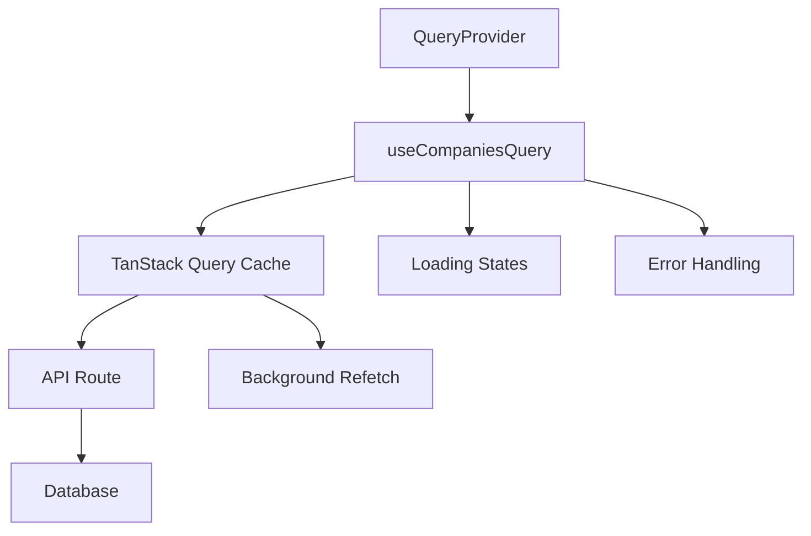
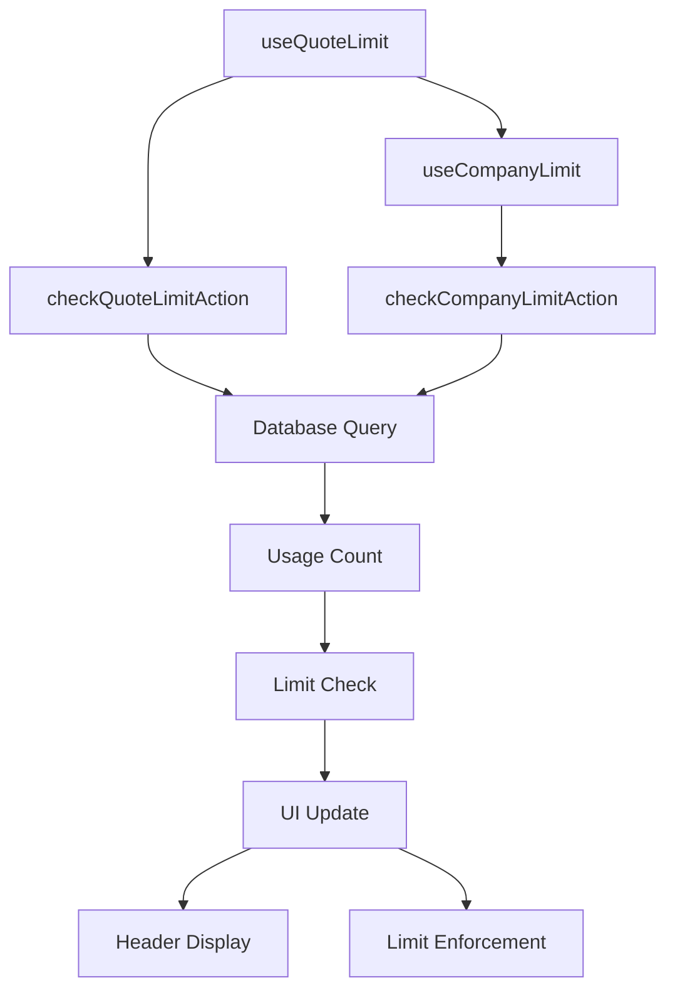
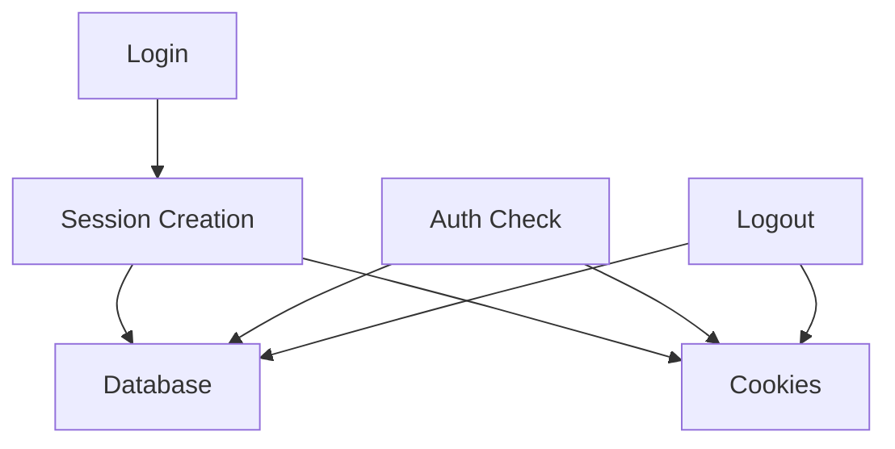

# System Patterns

## Architecture Overview

### Authentication System

- Database-backed sessions with secure cookie handling
- Client-side state management using Zustand
- Server-side session validation and management
- Middleware-based route protection
- Provider pattern for auth state management

### UI Components

- Responsive navbar with scroll-based animations
- Theme-aware components with dark mode support
- Form components with validation and error handling
- Toast notifications for user feedback
- **NEW: Skeleton loading states for better UX**
- **NEW: Subscription limit components with upgrade prompts**

### State Management

- Zustand for global state (auth, theme)
- **NEW: TanStack Query for server state (implemented)**
- Local storage for persistence
- Context providers for theme and auth

### Security Patterns

- Password hashing with bcrypt and pepper
- Secure session cookies (httpOnly, sameSite)
- CSRF protection
- Rate limiting preparation
- Input validation with Zod

### API Patterns

- RESTful API routes
- Middleware for route protection
- Error handling and validation
- Session management
- Database operations with Drizzle ORM

### **NEW: Data Fetching Patterns**

- TanStack Query for intelligent caching
- 5-minute stale time, 10-minute cache time
- Background refetching for fresh data
- Automatic retries for failed requests
- Query keys based on user ID for proper invalidation
- Dev tools for debugging and monitoring

### **NEW: Loading State Patterns**

- Skeleton loading over spinners for better UX
- Component-specific skeletons (SidebarSkeleton, DashboardSkeleton, etc.)
- Loading states that match content structure
- No flashing content or race conditions
- Progressive loading with meaningful placeholders

### **NEW: Subscription Tracking Patterns**

- Real-time usage monitoring with database integration
- Monthly quote usage tracking with automatic resets
- Company limit enforcement for free users
- Subscription tier-based feature access
- Upgrade prompts when limits are reached
- Header-based status display for always-visible information

## Component Relationships

### Auth Flow



### **NEW: Data Fetching Flow**



### **NEW: Subscription Tracking Flow**



### Session Management



## Design Patterns

### Provider Pattern

- AuthProvider for authentication state
- ThemeProvider for theme management
- ToastProvider for notifications
- **NEW: QueryProvider for data fetching**

### Hook Pattern

- useAuth for authentication
- useTheme for theme management
- **NEW: useCompaniesQuery for optimized data fetching**
- **NEW: useQuoteLimit for subscription tracking**
- **NEW: useCompanyLimit for company limits**
- Custom hooks for reusable logic

### Middleware Pattern

- Route protection
- Session validation
- API route protection

### **NEW: Skeleton Pattern**

- Component-specific skeleton loading
- Structure matching the actual content
- Smooth transitions without flashing
- Progressive content reveal

### **NEW: Subscription Pattern**

- Usage tracking with database integration
- Limit enforcement with graceful degradation
- Upgrade prompts with contextual messaging
- Header-based status display
- Real-time updates with TanStack Query

## Technical Decisions

### Database

- PostgreSQL with Drizzle ORM
- Session storage in database
- User and account management
- **NEW: Quotes table with subscription tracking**
- **NEW: Quote status enum for workflow management**

### Authentication

- Database-backed sessions
- Secure cookie handling
- Regular auth checks

### UI/UX

- Responsive design
- Theme support
- Animation system
- **NEW: Skeleton loading states**
- **NEW: TanStack Query for smooth data fetching**
- **NEW: Subscription limit components**

### **NEW: Data Fetching**

- TanStack Query for intelligent caching
- Background refetching for fresh data
- Proper error handling and retries
- Dev tools for debugging

### **NEW: Subscription Management**

- Database-driven usage tracking
- Monthly reset cycles for quote limits
- Real-time limit enforcement
- Professional upgrade messaging
- Header integration for status visibility

## Implementation Notes

- All components are type-safe
- Error handling is comprehensive
- Security is prioritized
- Performance is monitored
- Code is modular and maintainable
- **NEW: Loading states are meaningful and non-jarring**
- **NEW: Data fetching is optimized and cached**
- **NEW: Subscription limits are enforced gracefully**

## **NEW: TanStack Query Patterns**

### Query Configuration

```typescript
const {
  data: companies = [],
  isLoading,
  error,
  refetch,
} = useQuery({
  queryKey: ['companies', user?.id],
  queryFn: async () => {
    if (!user) return []
    const result = await getUserCompaniesAction(user.id)
    if (result.success && result.companies) {
      return result.companies
    }
    throw new Error(result.error || 'Failed to fetch companies')
  },
  enabled: !!user,
  staleTime: 5 * 60 * 1000, // 5 minutes
  gcTime: 10 * 60 * 1000, // 10 minutes
})
```

### **NEW: Subscription Query Patterns**

```typescript
// Quote limit tracking
const {
  canCreate,
  currentQuotes,
  upgradeMessage,
  isLoading,
  error,
  refetch,
} = useQuery({
  queryKey: ['quote-limit', user?.id],
  queryFn: async () => {
    if (!user) return null
    return await checkQuoteLimitAction(user.id, user.subscriptionTier)
  },
  enabled: !!user,
  staleTime: 2 * 60 * 1000, // 2 minutes
})

// Company limit tracking
const {
  canCreate,
  currentCompanies,
  upgradeMessage,
  isLoading,
  error,
  refetch,
} = useQuery({
  queryKey: ['company-limit', user?.id],
  queryFn: async () => {
    if (!user) return null
    return await checkCompanyLimitAction(user.id, user.subscriptionTier)
  },
  enabled: !!user,
  staleTime: 5 * 60 * 1000, // 5 minutes
})
```

### Query Provider Setup

```typescript
const [queryClient] = useState(
  () =>
    new QueryClient({
      defaultOptions: {
        queries: {
          staleTime: 5 * 60 * 1000, // 5 minutes
          gcTime: 10 * 60 * 1000, // 10 minutes
          retry: 1,
        },
      },
    }),
)
```

## **NEW: Subscription Management Patterns**

### Database Functions

```typescript
// Get current month quotes
export async function getCurrentMonthQuotes(userId: string): Promise<number> {
  const startOfMonth = new Date()
  startOfMonth.setDate(1)
  startOfMonth.setHours(0, 0, 0, 0)

  const result = await db
    .select({ count: quotes.id })
    .from(quotes)
    .where(and(eq(quotes.userId, userId), gte(quotes.createdAt, startOfMonth)))

  return result.length
}

// Check if user can create quote
export async function canUserCreateQuote(
  userId: string,
  userTier: SubscriptionTier,
): Promise<boolean> {
  const currentQuotes = await getCurrentMonthQuotes(userId)
  return canCreateQuote(userTier, currentQuotes)
}
```

### Server Actions

```typescript
// Check quote limits
export async function checkQuoteLimitAction(
  userId: string,
  userTier: 'free' | 'pro',
) {
  try {
    const canCreate = await canUserCreateQuote(userId, userTier)
    const currentQuotes = await getCurrentMonthQuotes(userId)
    const upgradeMessage = getUpgradeMessage('quotes', userTier)

    return {
      success: true,
      canCreate,
      currentQuotes,
      upgradeMessage,
    }
  } catch (error) {
    console.error('Error checking quote limit:', error)
    return {
      success: false,
      error: 'Failed to check quote limit',
    }
  }
}
```

### UI Components

```typescript
// Subscription limit card
export function SubscriptionLimit({
  title,
  description,
  currentUsage,
  maxUsage,
  upgradeMessage,
  onUpgrade,
}: SubscriptionLimitProps) {
  const isUnlimited = maxUsage === -1 || maxUsage === 'Unlimited'
  const usagePercentage = isUnlimited ? 0 : (currentUsage / (maxUsage as number)) * 100

  return (
    <Card className="border-dashed">
      <CardHeader className="text-center">
        <div className="mx-auto mb-2 flex h-12 w-12 items-center justify-center rounded-full bg-muted">
          <Lock className="h-6 w-6 text-muted-foreground" />
        </div>
        <CardTitle className="text-lg">{title}</CardTitle>
        <CardDescription>{description}</CardDescription>
      </CardHeader>
      <CardContent className="space-y-4">
        {/* Usage display and progress bar */}
        {/* Upgrade messaging */}
        {/* Upgrade button */}
      </CardContent>
    </Card>
  )
}
```

## **NEW: Header Integration Pattern**

### Layout Integration

```typitten
// Server-side quote usage fetching
let quoteUsage = null
try {
  if (user.subscriptionTier === 'free') {
    const currentQuotes = await getCurrentMonthQuotes(user.id)
    quoteUsage = { current: currentQuotes, max: 3 }
  }
} catch (error) {
  console.error('Error fetching quote usage:', error)
  quoteUsage = { current: 0, max: 3 }
}

// Header display
{quoteUsage && (
  <div className="flex items-center gap-2 text-sm">
    <span className="text-muted-foreground">Quotes:</span>
    <Badge variant="outline" className="text-xs">
      {quoteUsage.current}/{quoteUsage.max}
    </Badge>
  </div>
)}
```
