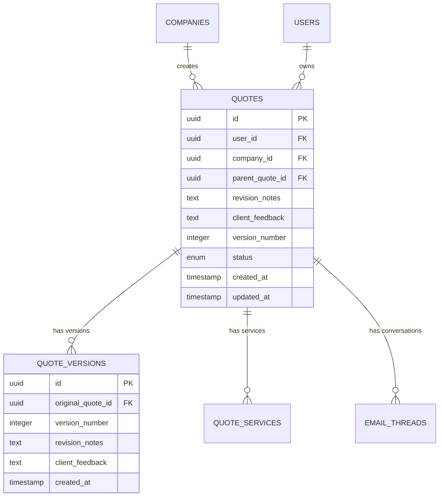

# Quote Editing System

## Overview

The Quote Editing System enables users to revise existing quotes when clients request changes. This system integrates with the existing email conversation tracking and AI-powered quote generation to provide a seamless revision workflow.

## Current System State

### ✅ Completed Features

- **Quote Creation**: Full AI-assisted quote generation with pricing recommendations
- **Quote Status Management**: Status tracking (`draft`, `sent`, `accepted`, `rejected`, `revised`)
- **Email Integration**: Gmail OAuth connection and email sending
- **Conversation Tracking**: Email thread management with quote linking
- **PDF Generation**: Professional quote PDFs with company branding
- **Manual Status Updates**: Status dropdown in conversation detail pages

### 🔄 Quote Status Flow

```
draft → sent → accepted/rejected/revised
```

## Quote Editing Flow

### Trigger Points

#### 1. **Conversation Detail Page**

- User changes quote status to "revised" via dropdown
- "Edit Quote" button appears for quotes with status "revised" or "rejected"
- Direct access to edit workflow from conversation context

#### 2. **Quotes List Page**

- "Edit Quote" button for quotes with status "revised" or "rejected"
- Bulk edit options for multiple quotes
- Quick access to revision history

#### 3. **Email Response Context**

- Client requests changes via email
- System detects revision requests and suggests quote editing
- Automatic status update to "revised"

### Edit Quote Page Flow

```
Conversation Detail → "Edit Quote" Button → Edit Quote Page → Preview → Send
```

#### **Page Structure**

1. **Quote Information Header**

   - Original quote details (project title, client, date)
   - Current status and revision number
   - Client feedback summary

2. **Pre-populated Form**

   - Project details (title, description, timeline, complexity)
   - Service selection with existing quantities and pricing
   - Client information (name, email, location, budget)
   - Original terms and conditions

3. **Revision Controls**

   - "Add Service" button for new services
   - "Remove Service" option for existing services
   - Price adjustment sliders/inputs
   - Notes and terms editing

4. **AI Re-analysis Section**

   - Re-run AI analysis with client feedback context
   - Updated pricing recommendations
   - Market analysis refresh
   - Negotiation suggestions

5. **Preview and Comparison**
   - Side-by-side original vs revised quote
   - Change highlighting
   - Revision summary
   - Final quote preview

## Implementation Phases

### Phase 1: Core Editing (Priority 1)

#### **Database Schema Updates**

```sql
-- Quote versions table
CREATE TABLE quote_versions (
  id UUID PRIMARY KEY DEFAULT gen_random_uuid(),
  original_quote_id UUID REFERENCES quotes(id) ON DELETE CASCADE,
  version_number INTEGER NOT NULL,
  revision_notes TEXT,
  client_feedback TEXT,
  created_at TIMESTAMP DEFAULT NOW(),
  updated_at TIMESTAMP DEFAULT NOW()
);

-- Add revision fields to quotes table
ALTER TABLE quotes ADD COLUMN parent_quote_id UUID REFERENCES quotes(id);
ALTER TABLE quotes ADD COLUMN revision_notes TEXT;
ALTER TABLE quotes ADD COLUMN client_feedback TEXT;
ALTER TABLE quotes ADD COLUMN version_number INTEGER DEFAULT 1;
```

#### **New Server Actions**

```typescript
// src/app/server-actions/quote.ts

// Get quote for editing (with all data)
export async function getQuoteForEditingAction(quoteId: string)

// Create revised quote
export async function createRevisedQuoteAction(data: {
  originalQuoteId: string
  revisionData: CreateQuoteData
  revisionNotes: string
  clientFeedback?: string
})

// Get quote version history
export async function getQuoteVersionHistoryAction(quoteId: string)

// Compare quotes side by side
export async function compareQuotesAction(quoteId1: string, quoteId2: string)
```

#### **New Pages**

- `src/app/(protected)/quotes/[quoteId]/edit/page.tsx` - Edit quote page
- `src/app/(protected)/quotes/[quoteId]/versions/page.tsx` - Version history
- `src/app/(protected)/quotes/[quoteId]/compare/page.tsx` - Quote comparison

#### **UI Components**

- `src/components/ui/quote-editor.tsx` - Main editing interface
- `src/components/ui/quote-comparison.tsx` - Side-by-side comparison
- `src/components/ui/revision-notes.tsx` - Revision notes editor
- `src/components/ui/version-history.tsx` - Version history display

### Phase 2: Enhanced Features (Priority 2)

#### **Client Feedback Integration**

- Parse client feedback from email conversations
- Extract specific revision requests
- Auto-populate revision notes
- Track feedback sentiment and urgency

#### **Advanced Comparison**

- Diff highlighting for text changes
- Visual indicators for pricing changes
- Service addition/removal tracking
- Timeline and terms comparison

#### **AI Re-analysis Enhancement**

- Context-aware AI prompts with client feedback
- Previous quote analysis for better recommendations
- Market condition updates
- Competitive positioning refresh

#### **Workflow Improvements**

- Revision templates for common changes
- Bulk revision operations
- Automated revision suggestions
- Revision approval workflow

### Phase 3: Advanced Features (Priority 3)

#### **Analytics and Insights**

- Revision frequency tracking
- Common revision patterns
- Client satisfaction metrics
- Quote acceptance rate by revision

#### **Automation Features**

- Auto-detect revision requests in emails
- Smart revision suggestions
- Automated quote status updates
- Revision reminder system

#### **Collaboration Features**

- Multi-user revision approval
- Revision comments and discussions
- Client feedback integration
- Revision timeline tracking

## Technical Implementation Details

### **State Management**

```typescript
interface QuoteEditState {
  originalQuote: Quote | null
  revisedQuote: Partial<CreateQuoteData>
  revisionNotes: string
  clientFeedback: string
  changes: QuoteChange[]
  isDirty: boolean
  isLoading: boolean
}
```

### **Change Tracking**

```typescript
interface QuoteChange {
  type: 'service_added' | 'service_removed' | 'price_changed' | 'terms_changed'
  field: string
  oldValue: any
  newValue: any
  description: string
}
```

### **API Endpoints**

```typescript
// GET /api/quotes/[id]/edit - Get quote for editing
// POST /api/quotes/[id]/revise - Create revised quote
// GET /api/quotes/[id]/versions - Get version history
// GET /api/quotes/[id]/compare/[versionId] - Compare versions
```

### **Email Integration**

- Automatic quote status updates when sending revised quotes
- Revision notes included in email body
- PDF attachment with revision indicators
- Follow-up email templates for revised quotes

## User Experience Flow

### **1. Initiating Revision**

1. User opens conversation with client
2. Client requests changes via email
3. User changes quote status to "revised"
4. "Edit Quote" button appears
5. User clicks to start revision process

### **2. Editing Process**

1. Pre-populated form loads with original data
2. User reviews client feedback
3. User makes necessary changes
4. AI provides updated recommendations
5. User previews changes
6. User saves revised quote

### **3. Sending Revised Quote**

1. User generates new PDF with revision notes
2. User composes email with revision summary
3. User sends email with PDF attachment
4. Quote status updates to "sent"
5. Conversation thread continues

## File Structure

```
src/app/(protected)/quotes/
├── README.md                    # This file
├── page.tsx                     # Quotes list page
├── [quoteId]/
│   ├── edit/
│   │   ├── page.tsx            # Edit quote page
│   │   └── _components/
│   │       ├── quote-editor.tsx
│   │       ├── revision-notes.tsx
│   │       └── change-summary.tsx
│   ├── versions/
│   │   ├── page.tsx            # Version history page
│   │   └── _components/
│   │       └── version-timeline.tsx
│   └── compare/
│       ├── page.tsx            # Comparison page
│       └── _components/
│           └── quote-diff.tsx
└── _components/
    ├── quote-card.tsx          # Enhanced with edit button
    └── quote-actions.tsx       # Edit, compare, versions
```

## Database Relationships



## Testing Strategy

### **Unit Tests**

- Quote editing form validation
- Change tracking logic
- Version comparison algorithms
- AI re-analysis prompts

### **Integration Tests**

- End-to-end revision workflow
- Email integration with revised quotes
- Database version tracking
- PDF generation with revision notes

### **User Acceptance Tests**

- Complete revision workflow
- Client feedback integration
- Comparison view accuracy
- Email delivery with attachments

## Performance Considerations

### **Optimization Strategies**

- Lazy loading of version history
- Efficient diff algorithms for comparison
- Caching of AI analysis results
- Optimized PDF generation

### **Scalability**

- Pagination for version history
- Efficient change tracking
- Background processing for AI analysis
- CDN for PDF storage

## Security Considerations

### **Access Control**

- User ownership validation for quotes
- Company-level access restrictions
- Revision history access control
- Secure PDF generation

### **Data Integrity**

- Version number validation
- Change tracking audit logs
- Backup and recovery procedures
- Data validation at all layers

## Future Enhancements

### **Advanced AI Features**

- Automated revision suggestions
- Client feedback analysis
- Market trend integration
- Competitive pricing updates

### **Collaboration Features**

- Multi-user editing
- Revision approval workflows
- Client feedback portals
- Real-time collaboration

### **Analytics and Reporting**

- Revision success metrics
- Client satisfaction tracking
- Quote acceptance rates
- Performance analytics

## Conclusion

The Quote Editing System provides a comprehensive solution for managing quote revisions in response to client feedback. The phased implementation approach ensures core functionality is delivered quickly while allowing for future enhancements based on user feedback and business needs.

The system integrates seamlessly with existing email tracking, AI assistance, and PDF generation capabilities to provide a complete quote management solution.
